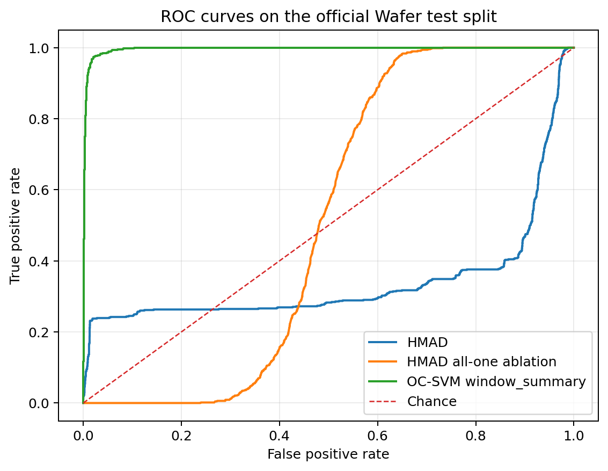
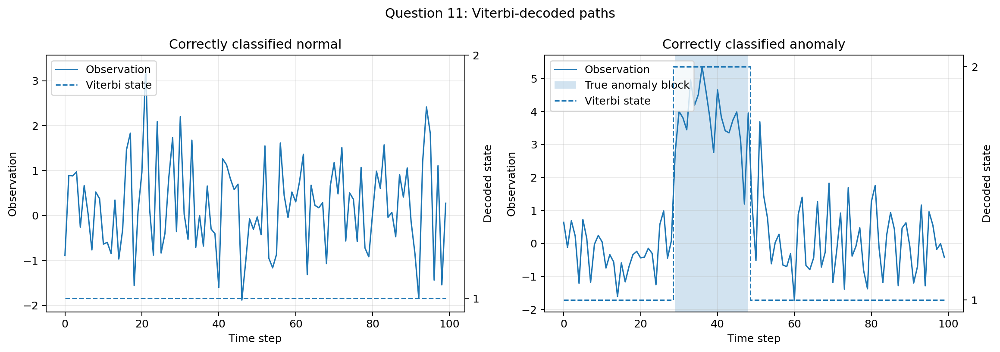

# HMAD Wafer Anomaly Detection

Sequence anomaly detection with One-Class SVM (OC-SVM), Gaussian hidden Markov models, log-space Viterbi decoding, and a simplified Hidden Markov Anomaly Detection (HMAD) pipeline.

This is an individual portfolio edition maintained by [AydinEZP](https://github.com/AydinEZP). The underlying university project was developed collaboratively and was approved for separate individual publication; this edition presents the integrated implementation without assigning undocumented fine-grained ownership of individual components.

## Research question

Can a compact representation derived from hidden-state dynamics improve sequence anomaly detection over fixed-vector OC-SVM baselines?

The project evaluates that question on two complementary settings:

- the real UCR/TSML **Wafer** benchmark, with sequence-level labels;
- a deterministic **Gaussian block-anomaly** generator, with known anomaly intervals.

## Methods

- OC-SVM with flattened, global-summary, and local-window representations
- Gaussian HMM sampling and parameter estimation
- numerically stable log-space Viterbi decoding
- simplified HMAD features based on decoded state transitions and state-conditioned statistics
- all-one-state ablation
- contamination, block-length, and block-count sensitivity experiments

## Selected results

The following values come from the archived machine-readable results in [`results/`](results/):

| Dataset / experiment | Model | Metric |
|---|---|---:|
| Wafer official test | OC-SVM, five-window summary | ROC-AUC **0.9958** |
| Wafer official test | Simplified HMAD | ROC-AUC **0.3402** |
| Wafer official test | HMAD all-one-state ablation | ROC-AUC **0.5123** |
| Gaussian, 20-step block | HMAD and evaluated OC-SVM baselines | ROC-AUC **1.0000** |
| Gaussian, 5-step block | Simplified HMAD | ROC-AUC **0.5254** |

The main negative result is technically important: on Wafer, the compact HMM-derived feature representation loses local waveform detail that the window-based OC-SVM retains. Temporal structure alone does not guarantee a better anomaly detector.





## Repository layout

```text
configs/       experiment configuration
data/          dataset documentation (raw Wafer files are not included)
docs/figures/  selected, publication-safe result figures
experiments/   experiment entry points
results/       archived machine-readable metric tables
scripts/       dataset inspection and audit utilities
src/           model, feature, evaluation, and data-loading modules
tests/         unit and integration tests
```

## Quick start

Python 3.10 or newer is recommended.

```bash
python -m venv .venv
```

Activate the environment, then install and test:

```bash
python -m pip install -r requirements.txt
python -m pytest -q
```

Validation on Python 3.12 (2026-09-29): **51 tests passed**.

The Gaussian experiments are self-contained:

```bash
python experiments/run_gaussian_required.py
```

The Wafer experiments require `Wafer_TRAIN.ts` and `Wafer_TEST.ts` under `data/Wafer/`. Raw datasets are intentionally not redistributed. See [REPRODUCING_RESULTS.md](REPRODUCING_RESULTS.md) and [DATASET_CARD.md](DATASET_CARD.md).

## Reproducibility notes

- Random seeds and dataset conventions are documented in the dataset READMEs.
- Feature scaling is fitted on training data only.
- Only normal training sequences are used for one-class fitting.
- Continuous anomaly scores are the negative of model normality scores.
- The complete official Wafer test split is retained for primary evaluation.
- Generated outputs are written under `outputs/` and are intentionally ignored by Git.

## Publication scope

This repository omits raw third-party datasets, bulk generated arrays, internal team handoff documents, institutional contact details, student identifiers, and the original team-facing report. The included figures and CSV files are selected technical outputs without private metadata or local paths.

## License

No open-source license has been selected. See [LICENSE-TODO.md](LICENSE-TODO.md) before reusing or redistributing the code.
